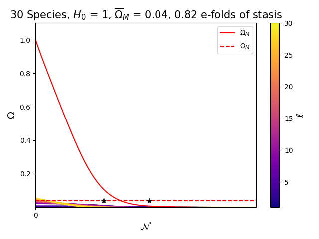
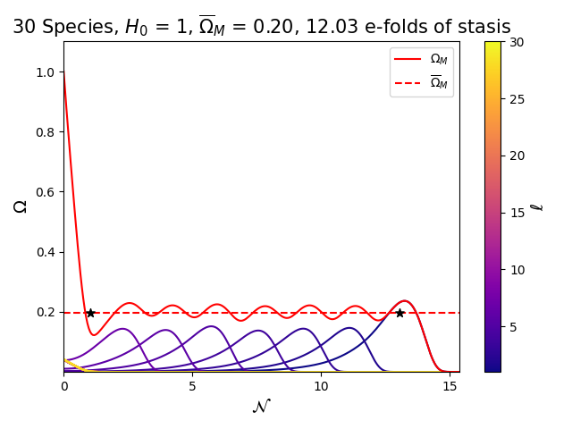

# On the Generality and Persistence of Cosmological Stasis

[](https://github.com/snehjp2/diff-stasis/blob/main/LICENSE)
[](https://www.python.org/downloads/release/python-390/)

Implementation of [2408.00835](https://arxiv.org/abs/2408.00835) by James Halverson and Sneh Pandya.

<table>
    <tr>
        <td></td>
        <td></td>
    </tr>
</table>

## Abstract

Hierarchical decays of $N$ matter species to radiation may balance against Hubble expansion to yield stasis, a new phase of cosmological evolution with constant matter and radiation abundances. We analyze stasis with various machine learning techniques on the full $2N$-dimensional space of decay rates and abundances, which serve as inputs to the system of Boltzmann equations that governs the dynamics. We construct a differentiable Boltzmann solver to maximize the number of stasis $e$-folds $\mathcal{N}$. High-stasis configurations obtained by gradient ascent motivate log-uniform distributions on rates and abundances to accompany power-law distributions of previous works. We demonstrate that random configurations drawn from these families of distributions regularly exhibit many $e$-folds of stasis. We additionally use them as priors in a Bayesian analysis conditioned on stasis, using stochastic variational inference with normalizing flows to model the posterior. All three numerical analyses demonstrate the generality of stasis and point to a new model in which the rates and abundances are exponential in the species index. We show that the exponential model solves the exact stasis equations, is an attractor, and satisfies $\mathcal{N}\propto N$, exhibiting inflation-level $e$-folding with a relatively low number of species. This is contrasted with the $\mathcal{N}\propto \log(N)$ scaling of power-law models. Finally, we discuss implications for the emergent string conjecture and string axiverse.

## Using this code

This project is developed for Python3.9 interpreter on a linux machine. Using an Anaconda virtual environment is recommended. Our implementation hinges on [`diffrax`](https://docs.kidger.site/diffrax/) and [`numpyro`](http://pyro.ai/numpyro/), packages built on [`jax`](https://jax.readthedocs.io/en/latest/) 🚀. 

To install dependencies, you can run

```console
pip install -r requirements.txt
```

or consult online documentation for appropriate dependencies. It is highly reccomended to follow jax install directions from the source.

Our codebase is structured as follows:

```src/scripts``` contains the main ingredients for our methodology.

- ```stasis_simulation_differentiable.py``` is the differentiable stasis simulation, containing the differentiable Boltzmann solver and stasis finder. This is used in SVI and gradient ascent experiments.
- ```stasis_simulation_non_diff.py``` is the **non-differentiable** stasis simulation. This is used for creating plots and features an accurate, sliding-window stasis finder algorithm. This also has parametric functionality built in via the `model` argument, which allows one to generate power-law and exponential-dependent stasis configurations.
- ```svi.py``` contains code for doing stochastic variational inference with normalizing flows. This requires a `yaml` file specifying experimental parameters, an example of which is given in `src/tutorials/example_svi_experiment.yaml`.

`src/tutorials` contains examples which coincide with the experiments in our paper. 

- ```gradient_ascent.ipynb``` gives a walk-through in how gradients in the simulation can be used to produce stasis with minimal physical biases in the initialization. It also visualizes the optimization trajectories with a gif.
- ```model_comparison.ipynb``` does a numerical comparison between power-law and exponential models of stasis. It also shows that both stasis models are attractors.
- ```random_stasis.ipynb``` shows that rates and abundances drawn from certain families of distributions can result in persistent epochs of stasis.


## Contact

**Code author:** Sneh Pandya <p> 

**Issues and questions:** @snehjp2, pandya.sne@northeastern.edu <p>

